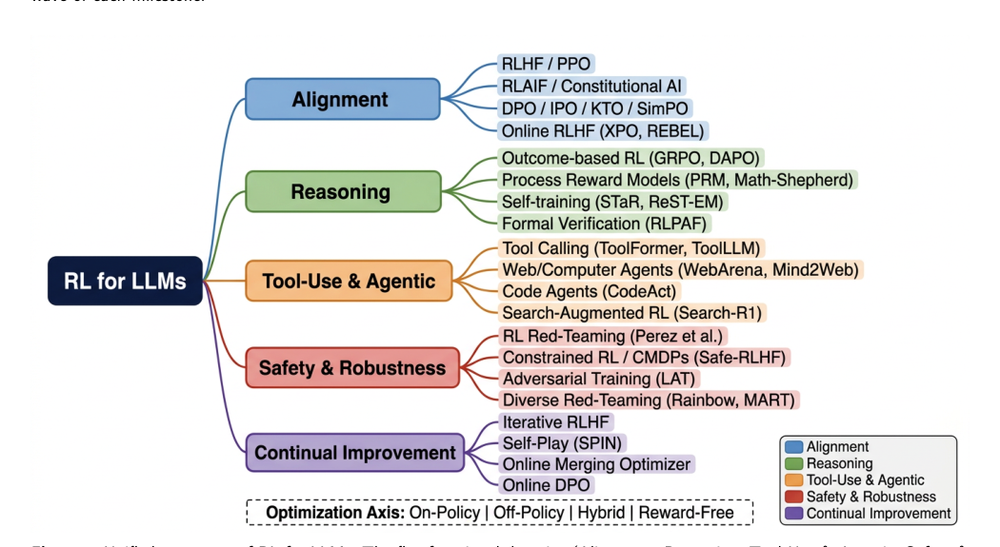
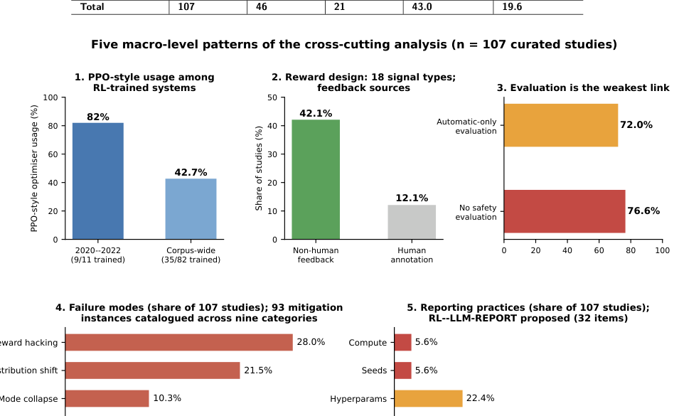
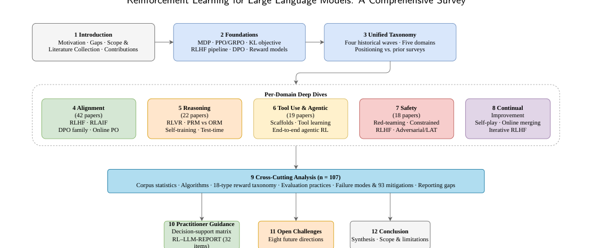
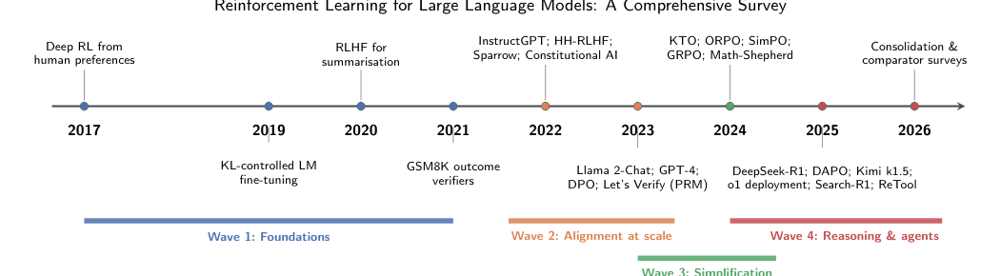

# Reinforcement Learning for Large Language Models

## A Comprehensive Survey from Alignment to Agentic Decision-Making

[](https://safwanalselwi.github.io/LLM-RL-SLR/)
[](paper.pdf)
[](#at-a-glance)
[](#rl--llm-report)
[](#scope)

**Ebrahim Hamid Sumiea · Zaid Fawaz Jarallah · Amgad Muneer · Safwan Mahmood Al-Selwi · Said Jadid Abdulkadir · Alawi Alqushaibi · Ashraf Osman Ibrahim · Mohammed Gamal Ragab · Jia Wu**

Universiti Teknologi PETRONAS · CeRDaS · The University of Texas MD Anderson Cancer Center · SDAIA-KFUPM Joint Research Center for Artificial Intelligence

> **Study design:** this work is a **narrative survey combined with a structured, purposive evidence map**. It is deliberately **not a systematic review**, and corpus percentages describe the curated sample rather than field-wide prevalence.

<p align="center">
  
</p>

## At a glance

| | |
|---|---|
| **107** | representative studies curated from 2017–2026 |
| **5** | functional domains |
| **18** | reward-signal types |
| **82** | RL-trained systems in the quantitative training stratum |
| **93** | reported mitigation instances across nine strategy categories |
| **32** | items in the proposed RL–LLM-REPORT checklist |

The five functional domains are **Alignment (42 papers)**, **Reasoning (22)**, **Tool Use & Agentic Behaviour (19)**, **Safety & Robustness (18)**, and **Continual Improvement (5)**, plus one pre-LLM foundation paper.

## Why this survey?

RL for LLMs has expanded far beyond the canonical RLHF pipeline. The literature now spans preference alignment, verifiable-reward reasoning, tool-using agents, safety-focused RL, and continual post-training. This survey provides a single cross-domain map that combines:

1. a **unified five-domain taxonomy**;
2. an **18-type reward-signal taxonomy**;
3. a **quantitative methodological audit** of the curated corpus;
4. a **practitioner decision-support matrix**;
5. **RL–LLM-REPORT**, a 32-item reporting checklist; and
6. **eight open research challenges**.

## Key findings

<p align="center">
  
</p>

- PPO-style actor–critic optimisation is used by **9/11 (82%)** of RL-trained systems in the 2020–2022 subset versus **35/82 (42.7%)** corpus-wide.
- Reward design spans **18 signal types**; non-human feedback sources appear in **42.1%** of studies versus **12.1%** using human annotation.
- **76.6%** of studies omit safety evaluation entirely, and **72.0%** use automatic-only evaluation.
- The most frequently reported failure modes are **reward hacking (28.0%)** and **distribution shift (21.5%)**.
- Reporting remains weak: only **5.6%** report compute budgets and **5.6%** report random seeds.

## Survey roadmap

<p align="center">
  
</p>

## Historical evolution

<p align="center">
  
</p>

The paper organises the field into four partially overlapping waves: **foundations**, **alignment at scale**, **simplification**, and **reasoning & agents**.

## Practitioner guidance

The paper provides a decision-support matrix rather than a one-algorithm-fits-all recommendation:

| Domain | Common starting point | Typical reward | Evaluation examples | Key pitfalls |
|---|---|---|---|---|
| Alignment | DPO / SimPO; PPO | Implicit preference or learned BT reward | AlpacaEval 2, MT-Bench, Arena-Hard, TruthfulQA | Length exploitation, reward hacking, alignment tax |
| Reasoning | GRPO / DAPO; PPO + PRM | Verifiable rule-based reward; PRM | MATH, GSM8K, AIME, ProcessBench | Format hacking, outcome-only masking of reasoning |
| Tool Use | PPO/GRPO with environment reward | Execution or environment feedback | WebArena, ToolBench | API misuse, hallucinated tool calls, limited safety evaluation |
| Safety | PPO with classifier / constraints | Classifier-based or adversarial reward | HarmBench, JailbreakBench | Mode collapse, over-refusal |
| Continual | Online DPO / iterative RLHF | Progressive reference or self-play | Held-out evaluation, capability retention | Forgetting, reward staleness |

## RL–LLM-REPORT

**RL–LLM-REPORT** is a proposed 32-item reporting checklist grouped into five categories:

- **A. Reward Definition** — 6 items
- **B. Dataset Disclosure** — 5 items
- **C. KL & Optimization** — 7 items
- **D. Annotation Process** — 6 items
- **E. Statistical Validation** — 8 items

The retrospective median score across the 82 scoreable trained systems is **47.2%** (range **32.8%–85.9%**). The paper proposes a **70% threshold on Mandatory items** as a starting submission expectation, while explicitly noting that the priorities, weights, and threshold are author-proposed and not yet externally validated.

See the complete checklist in the [project website](https://safwanalselwi.github.io/LLM-RL-SLR/#report).

## Open challenges

1. Reward-free methods for reasoning
2. Universal safety evaluation
3. Multimodal RL
4. Multi-agent RL for LLM systems
5. Scalable process supervision beyond mathematics
6. Attacker–defender equilibria
7. Continual and lifelong post-training
8. Methodological consolidation

## Scope

The corpus contains **107 representative studies** and was assembled through expert curation, major-venue monitoring, arXiv monitoring, and citation snowballing. The final dated update search was performed on **8 August 2026**. The corpus is **purposive**, designed to map the methodological landscape rather than estimate publication prevalence.

## Repository structure

```text
LLM-RL-SLR/
├── README.md
├── CITATION.cff
├── LICENSE
├── CONTRIBUTING.md
├── paper.pdf
├── figures/
│   ├── roadmap.png
│   ├── timeline.png
│   ├── taxonomy.png
│   ├── macro_patterns.png
│   └── report_checklist.png
├── data/
│   └── README.md
├── codebook/
│   └── README.md
├── scripts/
│   └── README.md
└── docs/
    ├── index.html
    ├── style.css
    ├── script.js
    ├── .nojekyll
    └── assets/
```

## Reproducibility package

The manuscript specifies the following release artifacts. **They are not fabricated in this starter package**; add the real files from the study when ready:

```text
data/evidence_table.csv
data/failure_mitigation_instances.csv
data/rlllm_report_scoring_matrix.csv
codebook/codebook.md
scripts/generate_scoring_matrix.py
scripts/reproduce_tables.py
```

The analysis script is described in the manuscript as recomputing the quantitative counts and percentages and checking expected values.

## Citation

Until a final DOI/venue citation is available, please cite the manuscript as:

```bibtex
@misc{sumiea2026rl_llm_survey,
  title  = {Reinforcement Learning for Large Language Models: A Comprehensive Survey from Alignment to Agentic Decision-Making},
  author = {Sumiea, Ebrahim Hamid and Jarallah, Zaid Fawaz and Muneer, Amgad and Al-Selwi, Safwan Mahmood and Abdulkadir, Said Jadid and Alqushaibi, Alawi and Ibrahim, Ashraf Osman and Ragab, Mohammed Gamal and Wu, Jia},
  year   = {2026},
  note   = {Preprint manuscript}
}
```

A machine-readable citation is also available in [`CITATION.cff`](CITATION.cff).

## Contributing

Corrections to bibliographic metadata, broken links, or reproducibility materials are welcome. Please see [`CONTRIBUTING.md`](CONTRIBUTING.md).

## License

A formal open license should be selected by the author team before encouraging redistribution or reuse. The current repository-level notice is provided in [`LICENSE`](LICENSE).

---

**Project website:** https://safwanalselwi.github.io/LLM-RL-SLR/
